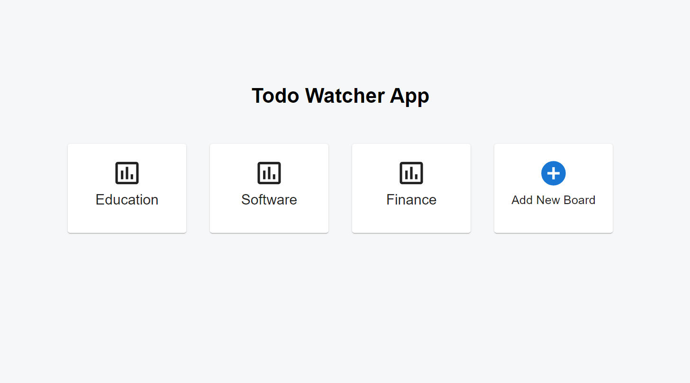
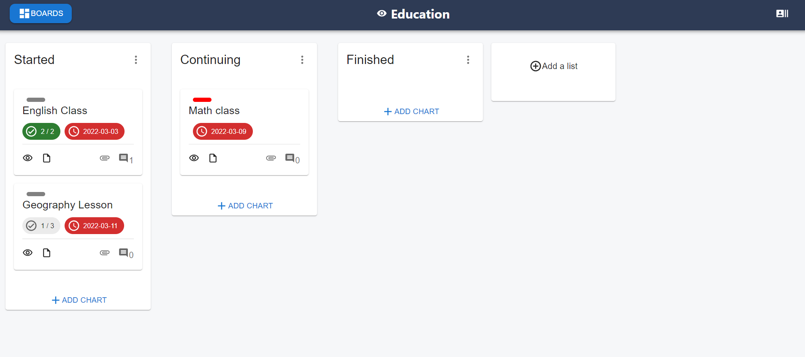
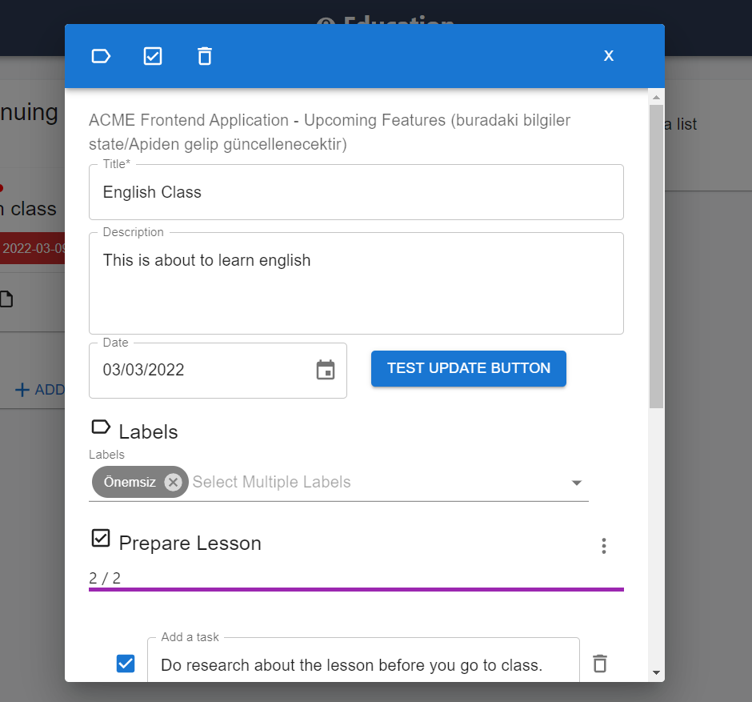

# Todo Watcher

## About
This project is a todo project that allows users to follow their work, edit and share their status.

This project has been developed by communicating with data from a docker back-end structure. The current designer and developer of the project is Berkay Gürcan.

## Details of Application
The user can add a board, list the boards and see the information by entering it, add a list to the board. You can update the list, add a card to the list. From the card detail page, you can update the card, delete it, and add a label indicating the task and importance level of the card. it can also enable it to view its information.Users can comment on cards.You can change the codes of the sites and also change the order of their lists with drag and drop

It includes the following pages:
- **Boards page**: User can view their board from here and add a new board

- **Board Content page**: It is the detail page of the board. You can edit and display the list information and card information of the board in this page. You can delete the board or add a user to the board thanks to the icon on the right side of the navbar. 

- **Login / Register page**: Pages with login processes
  

## Technologies Used
Made with **React.js**, **TypeScript**, **Redux-toolkit**, **JavaScript**, **ES6**, **HTML 5**, and **CSS3**.

# Getting Started with Create React App

This project was bootstrapped with [Create React App](https://github.com/facebook/create-react-app).

## Available Scripts

In the project directory, you can run:

### `npm start`

Runs the app in the development mode.\
Open [http://localhost:3000](http://localhost:3000) to view it in the browser.

The page will reload if you make edits.\
You will also see any lint errors in the console.

### `npm test`

Launches the test runner in the interactive watch mode.\
See the section about [running tests](https://facebook.github.io/create-react-app/docs/running-tests) for more information.

### `npm run build`

Builds the app for production to the `build` folder.\
It correctly bundles React in production mode and optimizes the build for the best performance.

The build is minified and the filenames include the hashes.\
Your app is ready to be deployed!

See the section about [deployment](https://facebook.github.io/create-react-app/docs/deployment) for more information.

### `npm run eject`

**Note: this is a one-way operation. Once you `eject`, you can’t go back!**

If you aren’t satisfied with the build tool and configuration choices, you can `eject` at any time. This command will remove the single build dependency from your project.

Instead, it will copy all the configuration files and the transitive dependencies (webpack, Babel, ESLint, etc) right into your project so you have full control over them. All of the commands except `eject` will still work, but they will point to the copied scripts so you can tweak them. At this point you’re on your own.

You don’t have to ever use `eject`. The curated feature set is suitable for small and middle deployments, and you shouldn’t feel obligated to use this feature. However we understand that this tool wouldn’t be useful if you couldn’t customize it when you are ready for it.

## Learn More

You can learn more in the [Create React App documentation](https://facebook.github.io/create-react-app/docs/getting-started).

To learn React, check out the [React documentation](https://reactjs.org/).
